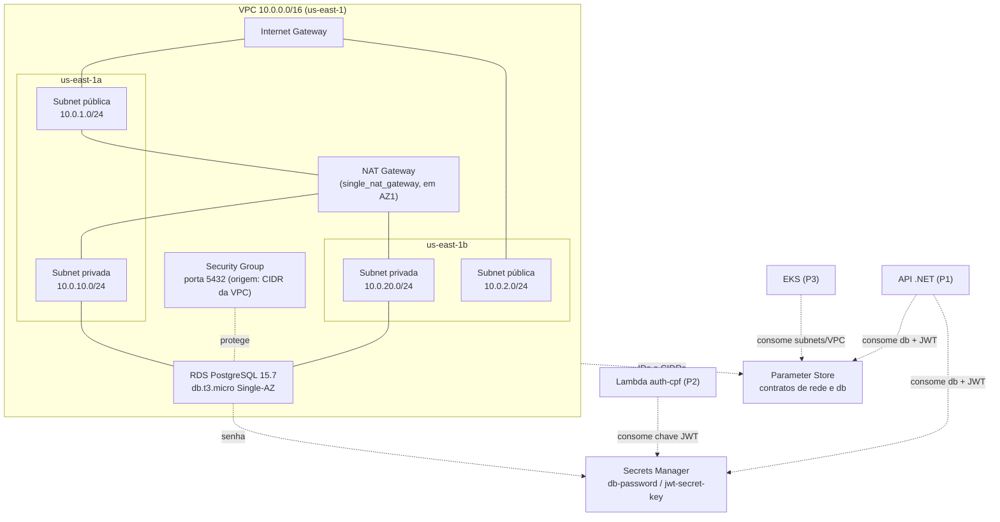

# Visão Geral da Arquitetura

Este repositório gerencia a infraestrutura AWS compartilhada para o projeto oficina:

- VPC com sub-redes públicas e privadas em duas Zonas de Disponibilidade
- NAT Gateway único para acesso à internet a partir das sub-redes privadas
- Instância RDS PostgreSQL em sub-redes privadas
- Secrets Manager para a senha do RDS e a chave secreta JWT
- Parameter Store para valores de infraestrutura não sensíveis publicados

> Para instruções de uso (pré-requisitos, como rodar, migrations, destroy), veja o [README.md](../README.md). Este documento foca nas decisões de design e no funcionamento interno da infraestrutura.

## Diagrama de rede

## Componentes lógicos

- `modules/vpc` — cria a rede compartilhada (via módulo comunitário vendorizado como git submodule em `modules/vpc/vendor/terraform-aws-vpc/`) e publica os IDs/CIDRs da VPC e sub-redes no Parameter Store.
- `modules/secrets` — cria os segredos no Secrets Manager para `db-password` (gerada aleatoriamente) e `jwt-secret-key`.
- `modules/rds` — cria a instância PostgreSQL em sub-redes privadas, o Security Group e o DB Subnet Group; publica o endpoint do banco de dados e metadados de credenciais no Parameter Store.

A vendorização do módulo VPC como submódulo git (em vez de referenciá-lo diretamente do Terraform Registry) é intencional: trava a versão do módulo comunitário usada pelo projeto e evita depender do Registry em tempo de `apply`.

## Ambientes

Cada ambiente tem seu próprio workspace do Terraform em `envs/`, instanciando os três módulos acima com o mesmo código — o que garante paridade entre `homolog` e `prod`:

- `envs/homolog`
- `envs/prod`

Cada ambiente contém:

- `main.tf`
- `backend.tf`
- `variables.tf`
- `terraform.tfvars.example`

O state de cada ambiente é armazenado remotamente em S3 (bucket `oficina-infra-db-terraform-state`, com chave `{env}/terraform.tfstate`) com lock via DynamoDB (tabela `oficina-infra-db-lock`), provisionados previamente por `bootstrap/`.

## Fluxo de implantação

1. Provisionar o backend remoto uma única vez com `terraform apply` em `bootstrap/` (S3 + DynamoDB).
2. Inicializar `envs/<ambiente>` com `terraform init`.
3. Validar com `terraform validate`.
4. Planejar com `terraform plan` (automático em PRs via workflow `plan.yml`).
5. Aplicar com `terraform apply` (disparo manual via `workflow_dispatch` no GitHub Actions, ou localmente).

## Fluxo de consumo pelos outros repositórios

Os três repositórios consomem esta infraestrutura exclusivamente por meio dos contratos publicados (nunca acessam o Terraform state diretamente):

| Consumidor | O que consome | Como |
|---|---|---|
| `oficina-infra-k8s` | VPC, subnets públicas/privadas, CIDR | Parameter Store |
| `oficina-mecanica-api` | Endpoint, porta, nome e usuário do RDS; Security Group ID | Parameter Store |
| `oficina-mecanica-api` | Senha do RDS; chave JWT | Secrets Manager |
| `oficina-lambda-auth` | Chave JWT (para validar/assinar tokens) | Secrets Manager |

## Trade-offs e decisões arquiteturais

A maior parte das decisões abaixo não são escolhas livres de design — são **imposições do ambiente AWS Academy Learner Lab**, documentadas aqui para deixar claro por que a infraestrutura não segue certas práticas recomendadas de produção:

- **RDS Single-AZ (`multi_az = false`):** o AWS Academy não permite Multi-AZ. Em um ambiente de produção real, isso seria Multi-AZ para alta disponibilidade.
- **`db.t3.micro`:** única classe de instância disponível no Academy; não é dimensionada para carga de produção real.
- **Sem Enhanced Monitoring / Performance Insights (`monitoring_interval = 0`, `performance_insights_enabled = false`):** recursos não suportados no Academy.
- **1 NAT Gateway (`single_nat_gateway = true`):** decisão de economia — um NAT por AZ elimina o ponto único de falha, mas duplica o custo. Como o budget do Academy é de US$ 50, optou-se por um único NAT Gateway compartilhado entre as duas AZs privadas.
- **`backup_retention_period = 1`:** valor mínimo permitido pela AWS para instâncias RDS; não há alternativa menor.
- **`recovery_window_in_days = 0`:** configurado no Secrets Manager para permitir exclusão imediata dos segredos ao rodar `terraform destroy`, sem período de retenção. Adequado para o ciclo de vida de curta duração de um ambiente acadêmico (recriado e destruído a cada sessão); não é recomendado para um ambiente de produção real, onde um período de recuperação evita perda acidental de segredos.
- **Sem IAM roles próprias:** o Academy só permite `LabRole`/`LabInstanceProfile`/`LabEksClusterRole`. Este repositório não cria nenhum recurso IAM.
- **Credenciais AWS de curta duração (4h):** por isso o `apply` é sempre manual (`workflow_dispatch`), nunca automático — evita falhas silenciosas de pipeline por expiração de sessão em execuções agendadas.

## Diagrama ER

O schema de dados da aplicação (consumida pelo `oficina-mecanica-api`, que roda sobre este RDS) está documentado em [`docs/diagrama-er.png`](diagrama-er.png). O diagrama reflete o schema real do PostgreSQL/EF Core — não é um placeholder — e cobre as entidades `Cliente`, `Veiculo`, `OrdemServico`, `ItemOrdemServico` e `Servico`.

## Contratos

Publicados no Parameter Store da SSM (`{env}` = `homolog` ou `prod`):

- `/oficina/{env}/network/vpc-id`
- `/oficina/{env}/network/vpc-cidr`
- `/oficina/{env}/network/public-subnet-ids`
- `/oficina/{env}/network/private-subnet-ids`
- `/oficina/{env}/db/endpoint`
- `/oficina/{env}/db/port`
- `/oficina/{env}/db/name`
- `/oficina/{env}/db/username`
- `/oficina/{env}/db/security-group-id`

Publicados no Secrets Manager:

- `oficina/{env}/db-password`
- `oficina/{env}/jwt-secret-key`

Ambos podem ser lidos com `aws ssm get-parameter` e `aws secretsmanager get-secret-value` respectivamente, usando as credenciais AWS Academy do consumidor — veja exemplos de uso no [README.md](../README.md#migrations-ef-core).

## Segurança

- **Segredos fora do código:** a senha do RDS é gerada aleatoriamente pelo Terraform (`random_password`, nunca hardcoded) e armazenada apenas no Secrets Manager; a chave JWT segue o mesmo padrão.
- **RDS não é público:** `publicly_accessible = false`, instância em sub-redes privadas, sem rota direta para a Internet (o tráfego de saída, quando necessário, passa pelo NAT Gateway).
- **Acesso ao RDS restrito à VPC:** o Security Group libera a porta 5432 apenas para o CIDR da própria VPC (`10.0.0.0/16`), não para a Internet.
- **Encryption at rest:** o RDS é criado com `storage_encrypted = true`; o bucket S3 do backend remoto usa SSE-AES256 e bloqueio de acesso público.
- **Sem IAM roles/policies próprias:** todas as execuções (local ou CI/CD) usam credenciais temporárias do AWS Academy (`LabRole`), nunca chaves de longa duração criadas por este projeto.

## Qualidade geral

Este documento complementa o [README.md](../README.md): o README cobre pré-requisitos, instruções de execução, migrations e destroy; este arquivo cobre o diagrama de rede, os componentes lógicos, os trade-offs de design e a postura de segurança da infraestrutura.
