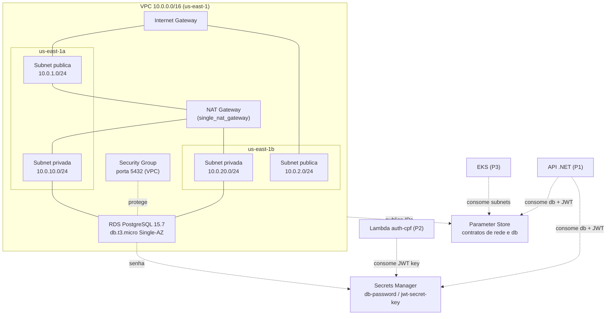

# Architecture Overview

This repository manages shared AWS infrastructure for the oficina project:

- VPC with public and private subnets in two AZs
- NAT Gateway for internet outbound access from private subnets
- RDS PostgreSQL instance in private subnets
- Secrets Manager for the RDS password and JWT secret key
- Parameter Store for published non-sensitive infrastructure values

## Diagrama de rede

## Logical components

- `modules/vpc` — creates shared networking, publishes VPC and subnet IDs to SSM Parameter Store
- `modules/secrets` — creates Secrets Manager secrets for `db-password` and `jwt-secret-key`
- `modules/rds` — creates PostgreSQL instance in private subnets and publishes db endpoint/credentials metadata to SSM Parameter Store

## Environments

Each environment has its own Terraform workspace under `envs/`:

- `envs/homolog`
- `envs/prod`

Each environment contains:

- `main.tf`
- `backend.tf`
- `variables.tf`
- `terraform.tfvars.example`

## Deployment flow

1. Initialize `envs/<environment>` with `terraform init`
2. Validate with `terraform validate`
3. Plan with `terraform plan`
4. Apply with `terraform apply` (manual dispatch on GitHub Actions or local)

## Contracts

Published to SSM Parameter Store:

- `/oficina/{env}/network/vpc-id`
- `/oficina/{env}/network/vpc-cidr`
- `/oficina/{env}/network/public-subnet-ids`
- `/oficina/{env}/network/private-subnet-ids`
- `/oficina/{env}/db/endpoint`
- `/oficina/{env}/db/port`
- `/oficina/{env}/db/name`
- `/oficina/{env}/db/username`
- `/oficina/{env}/db/security-group-id`

Published to Secrets Manager:

- `oficina/{env}/db-password`
- `oficina/{env}/jwt-secret-key`
